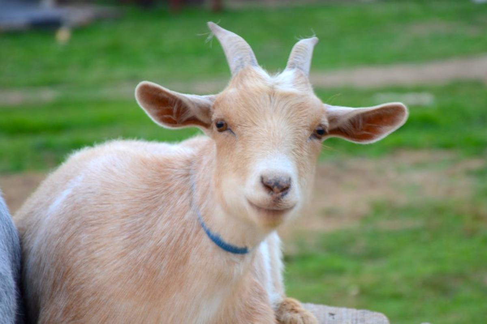

```{r setup, include=FALSE}
knitr::opts_chunk$set(echo = TRUE)
```

# Mi Prueba

## R Markdown

# Métodos

## Campo

### *Capra pyrenaica*

Me gustan las cabras, son muy graciosas, pero hacen sufrir a las plantitas con su herbivoría.



## Resultados

Se ha realizado un estudio para comprobar el crecimiento de plantas en biomasa según el acceso de cabras a las mismas.

```{r cars}
summary(cars)
```

## Including Plots

You can also embed plots, for example:

```{r pressure, echo=FALSE}
plot(pressure)
```

Note that the `echo = FALSE` parameter was added to the code chunk to prevent printing of the R code that generated the plot.
